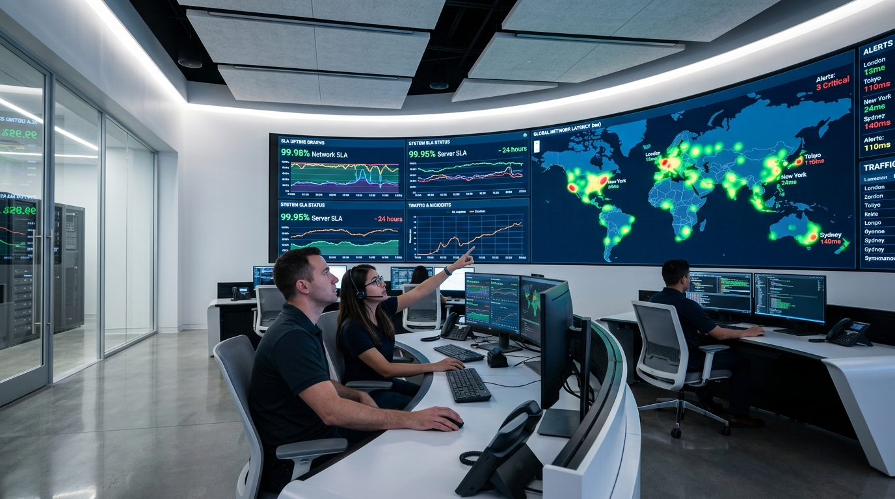

# 🛡️ Stackly SLA & SRE Command Center

> High-Availability Enterprise SLA Telemetry, Real-time Error Budget Tracking, and Contractual Penalty Simulation Cockpit.



## 🚀 Overview

**Stackly SLA Command Center** is a high-availability dashboard designed for enterprise Site Reliability Engineering (SRE), DevOps leaders, and infrastructure managers. It provides continuous compliance monitoring, automated burn rate analysis, and financial liability simulation against contractual SLA guarantees.

### ✨ Key Features

1. **SLO Health & Microservices Matrix**:
   - Live telemetry across core microservices (Core API Gateway, Transaction Ledger, Kafka Event Stream, Anycast Edge Cache).
   - Real-time p99 latency gauges, error percentage tracking, and query throughput.

2. **Error Budget & Multi-Window Burn Rates**:
   - 1h, 6h, and 24h multi-window burn rate alerts.
   - Interactive 12x traffic spike simulator to evaluate error budget depletion in real-time.

3. **Contractual SLA Penalty Simulator**:
   - Interactive outage slider (0–60 minutes) modeling real-time financial credit liability ($0 to $75,000 cap).
   - Tier-1, Tier-2, and Tier-3 breach calculation clauses.

4. **90-Day Uptime Heatmap**:
   - Granular day-by-day availability matrix with clickable day inspection.

5. **Live Incident Triage & War Room Stream**:
   - Incident severity log (P1/P2/P3), Mean Time to Detect (MTTD 42s), and Mean Time to Resolve (MTTR 4m 18s).

6. **Global Anycast Edge Latency Grid**:
   - 24 Points of Presence (PoPs) telemetry across US, Europe, and Asia-Pacific.

7. **5-Image Crossfading Landing Experience**:
   - Dynamic 5-image background slideshow with smooth crossfades and dedicated high-contrast obsidian dark theme.

8. **Official Stackly Dual-Swoosh Brand Identity**:
   - Authentic mint/teal (`#6ecbb7`) and marine navy (`#1b365d`) brand mark with cyber-orange accents.

---

## 🛠️ Tech Stack

- **Frontend**: HTML5, Vanilla JavaScript, CSS3, React 18, Vite
- **Icons & Graphics**: Inline SVG vector assets, Lucide React
- **Theme**: Obsidian Dark & Cyber Orange (`#ff6b00`, `#ff7800`)

---

## 💻 Quick Start

### Option 1: Standalone HTML (Zero Setup)
Simply open `index.html` directly in your web browser:
```bash
start index.html
```

### Option 2: Vite Dev Server
```bash
npm install
npm run dev
```

---

## 📄 License
Private / Proprietary - Stackly Enterprise.
